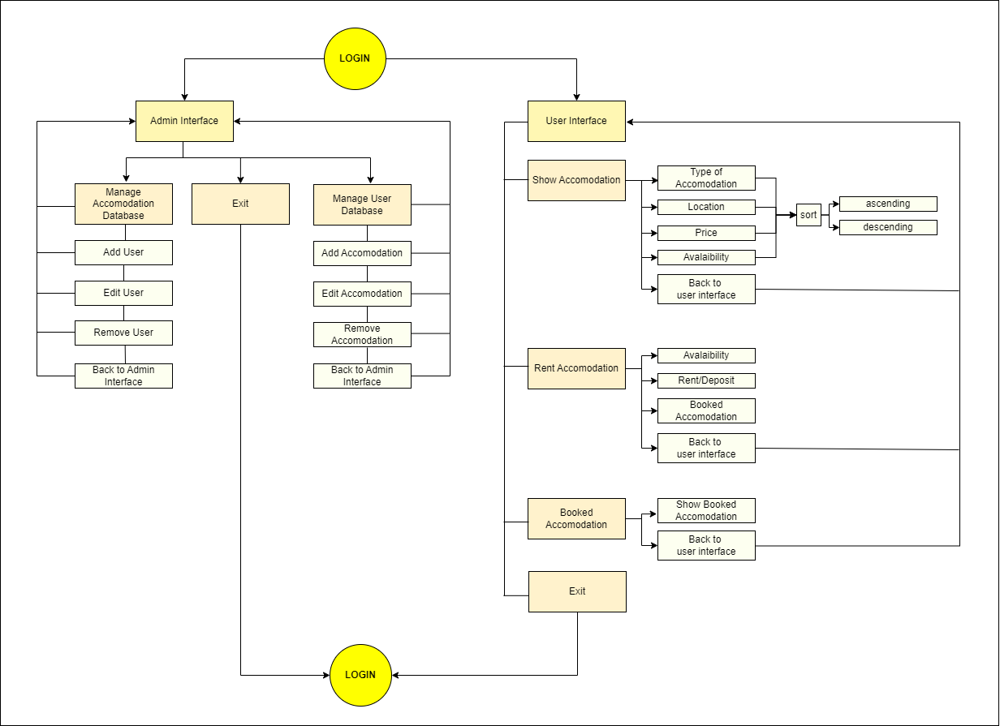

# **Rental Housing Program**

## Description

This project is a simple program based on authentication system implemented in Python. It allows users to log in with their username and password, and depending on their account type (admin or user), they are directed to different interfaces. 

## Content of Program (Flowchart)

 
## How to Install and Run the Project
   - Clone the project repository from [(https://github.com/ditasila/Purwadhika-DTIDS/)].
   - Ensure Python installed on the system (version 3.11 or higher).
   - Navigate to the project directory in terminal or command prompt.
   - Run the command: python DTIDS0106_CAPSTONE1_ANNISA_DITASILA.py

## How to Use the Project
   - Upon running the project, user will be prompted to enter username and password.
   - If user are an admin user, they will gain access to the admin interface where they can perform administrative tasks.
   - If user are a regular user, they will access the user interface with limited functionalities.
   - After five unsuccessful attempts, the system will lock you out for security reasons.

## Credit

Annisa Ditasila 

